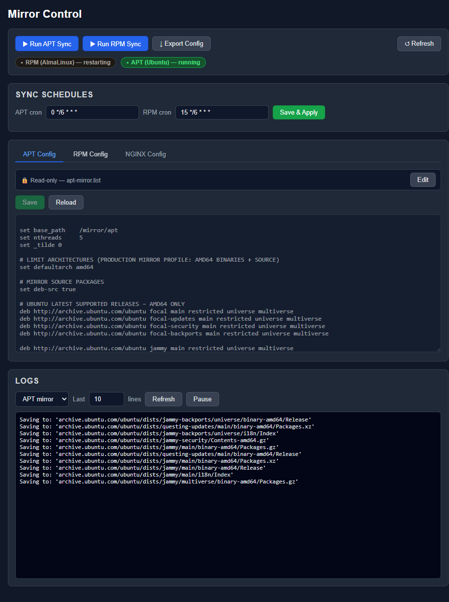
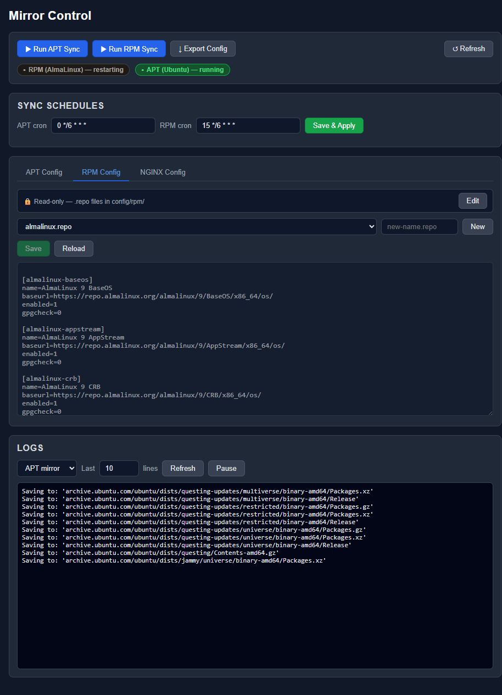

# apt-rpm-mirrorstack

Docker Compose stack for hosting a public Linux package mirror with:

- Ubuntu APT mirror (multi-release)
- Proxmox VE APT mirror
- AlmaLinux RPM mirror (BaseOS + AppStream)
- Arch Linux mirror (full tree via rsync)
- NGINX directory index frontend

## What this does

- Mirrors Ubuntu repositories to `./data/apt`
- Mirrors Proxmox VE repository to `./data/apt`
- Mirrors AlmaLinux repositories to `./data/alma`
- Mirrors a full Arch Linux tree to `./data/arch`
- Serves mirror content from NGINX on port `8090`
- Runs recurring sync jobs every 6 hours inside mirror containers

## Repository layout

- `docker-compose.yml`
- `config/apt-mirror.list`
- `config/schedules.env`
- `config/rpm/almalinux.repo`
- `config/nginx.conf`
- `config/www/index.html`
- `examples/` (extra distro snippets for Debian, Fedora, RHEL, Rocky, openSUSE, Arch)
- `arch-entrypoint.sh` (Arch mirror sync entrypoint)
- `data/` (mirror payload; ignored by git)

## Quick start

1. Install Docker and Docker Compose plugin.
2. Clone this repository:

```powershell
git clone git@github.com:jaydenthorup/apt-rpm-mirrorstack.git
```

3. Enter the project directory and start the stack:

```powershell
cd apt-rpm-mirrorstack
docker compose up -d --build
```

If you only want the UI first (and do **not** want to start mirror downloads yet):

```powershell
docker compose up -d control-ui
```

4. Open:

- `http://<host>:8090/`
- `http://<host>:8090/ubuntu/dists/`
- `http://<host>:8090/proxmox/dists/`
- `http://<host>:8090/alma/9/`
- `http://<host>:8090/arch/`
- `http://<host>:8088/` (Mirror Control UI)

By default, Arch sync uses a full-tree rsync source and mirrors into a dedicated `./data/arch` target.

## Mirror Control UI

This stack now includes a web UI on port `8088` for mirror operations.

Features:

- Edit and save `config/apt-mirror.list`
- Edit and save `config/rpm/*.repo`
- Edit and save `config/nginx.conf` with syntax validation and reload
- Trigger `apt` sync immediately
- Trigger `rpm` sync immediately
- Manage APT/RPM cron schedules and apply immediately
- View recent container logs for `ubuntu-mirror` and `rpm-mirror`
- Export a config snapshot JSON
- Tabbed config editors (APT/RPM/NGINX) with read-only-by-default edit lock

Open:

- `http://<host>:8088/`

### Screenshots

Overview (status, schedules, and default APT tab):



RPM config tab (read-only lock enabled by default):



Security note:

- The control UI container mounts `/var/run/docker.sock` so it can run `docker exec` for job triggers.
- Restrict network access to port `8088` to trusted admins only.

## Run flow

1. Start stack: `docker compose up -d`
2. Watch sync progress: `docker logs -f ubuntu-mirror` and `docker logs -f rpm-mirror` and `docker logs -f arch-mirror`
3. Browse mirror index: `http://<host>:8090/`
4. Stop stack when needed: `docker compose stop`

## Warnings

- Initial sync size can be very large (multi-terabyte for Ubuntu, hundreds of GBs for a full Arch tree).
- Downloads start automatically when mirror containers start.
- Recurring sync runs continue automatically every 6 hours (configurable per-service in `config/schedules.env`).
- Ensure your mirror volume has enough free space before starting or enabling additional distro suites.
- Stop all services with `docker compose stop` before maintenance or storage migration.

## Default sync schedule

- Ubuntu (`apt-mirror`): `0 */6 * * *`
- Alma (`reposync` + `createrepo_c`): `15 */6 * * *`
- Arch (`rsync`): `30 */6 * * *`

Persisted in `config/schedules.env` and editable in the Control UI.

## Client examples

### Ubuntu client

```bash
deb http://<mirror-host>:8090/ubuntu noble main restricted universe multiverse
deb http://<mirror-host>:8090/ubuntu noble-updates main restricted universe multiverse
deb http://<mirror-host>:8090/ubuntu noble-security main restricted universe multiverse
```

### AlmaLinux client

```ini
[mirror-baseos]
name=Mirror BaseOS
baseurl=http://<mirror-host>:8090/alma/9/BaseOS/x86_64/os/
enabled=1
gpgcheck=0

[mirror-appstream]
name=Mirror AppStream
baseurl=http://<mirror-host>:8090/alma/9/AppStream/x86_64/os/
enabled=1
gpgcheck=0
```

### Proxmox VE client

```bash
deb http://<mirror-host>:8090/proxmox bookworm pve-no-subscription
```

### Arch Linux client

```bash
# In /etc/pacman.d/mirrorlist or custom include
Server = http://<mirror-host>:8090/arch/core/os/$arch
Server = http://<mirror-host>:8090/arch/extra/os/$arch
Server = http://<mirror-host>:8090/arch/multilib/os/$arch
```

Or configure in `/etc/pacman.conf`:
```ini
[core]
Server = http://<mirror-host>:8090/arch/core/os/$arch

[extra]
Server = http://<mirror-host>:8090/arch/extra/os/$arch

[multilib]
Server = http://<mirror-host>:8090/arch/multilib/os/$arch
```

Implementation note: the Arch mirror service syncs a full upstream Arch tree into a dedicated `./data/arch` target using `rsync --delete`, so do not place unrelated files under that directory.

## More distro examples

See [examples/README.md](examples/README.md) for additional mirror snippets covering:

- Debian APT
- Fedora RPM
- RHEL/UBI RPM (entitlement required)
- Rocky Linux RPM
- Arch Linux
- openSUSE Leap RPM

## Ops notes

- Initial sync is large and can take many hours.
- Use fast storage and high bandwidth.
- Keep substantial free disk headroom for ongoing growth.

## Common commands

```powershell
docker compose ps
docker logs -f ubuntu-mirror
docker logs -f rpm-mirror
docker logs -f arch-mirror
docker compose stop
```

## License

This project is licensed under the MIT License. See `LICENSE` for details.
